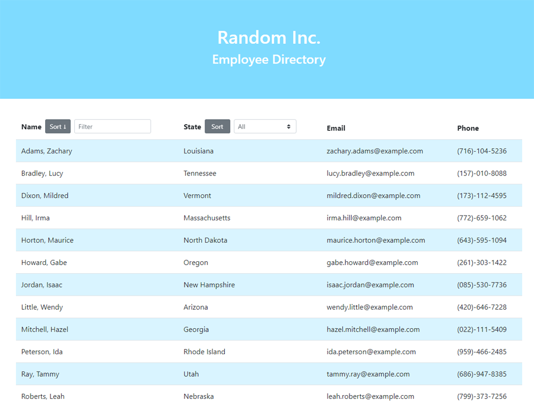

# employee-directory
[](https://opensource.org/licenses/ISC)

## Description
A single-page React application that allows for viewing, sorting, and filtering information about a list of randomly-generated employees. The employee list is generated when the page is started. Users can then sort by last name or state, filter by starting characters of first or last name, and filter by state.

## Table of Contents
* [Installation](#Installation)
* [Usage](#Usage)
* [Screenshot](#Screenshot)
* [Deployment](#Deployment)
* [License](#License)
* [Questions](#Questions)
* [Credits](#Credits)

## Installation
Install the application with
```
npm install
```

## Usage
The application can be started locally with
```
npm start
```

## Screenshot
  

## Deployment
This application has been deployed on GitHub Pages at https://malenchite.github.io/employee-directory

## License  
This application is covered under the **ISC** license. More info can be found here: [ISC](https://opensource.org/licenses/ISC)

## Questions
Questions about the project? You can contact me at malenchite@gmail.com or check out my GitHub profile at [malenchite](https://github.com/malenchite)

## Credits
Application was initialized using [Create React App](https://create-react-app.dev/)  
Employees are generated using the [Random User Generator API](https://randomuser.me/)
